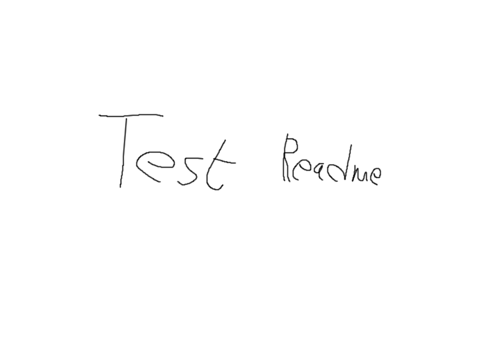

# 📦 ProjectName
Beschreibung des Projektes, kurz.

---

## 🚀 Features

- Komplett responsive und anpassbar
- Template für Portfolios oder kleine Webseiten
- Beispiel-Seiten für "Über mich", Projekte, Kontakt
- Einfache Anpassung für eigene Inhalte
- Inklusive Kontaktformular (funktional mit beliebigem Anbieter)
- 👉 [Weitere Doku gibt es im Wiki!](../../wiki)

---

## 📑 Vorschau

> **Screenshot:**  
> Zeige ein Bild aus deinem `images`-Order oder ein animiertes GIF

---

## 🛠️ Installation

Erklärung für die Installation
